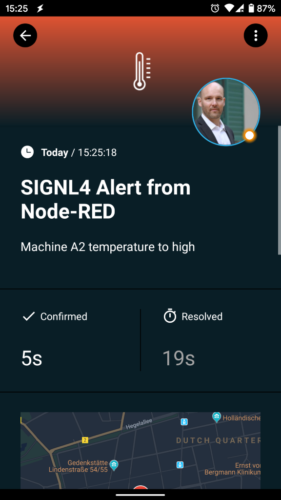

# SIGNL4 – IoI and IT On-Call Alerting and Duty Scheduling

In case of critical incidents in 24/7 IoT or IT operations with Node-RED, SIGNL4 is your tool for instant mobile alerting. SIGNL4 adds critical mobile alerting to Node-RED in no time. It bridges the ‘last mile’ from Node-RED to IoT or IT staff and on-call engineers.

Upon critical events it notifies team members reliably through persistent mobile push, text and voice calls with acknowledgement, tracking and escalation. Built-in duty scheduling provides for convenient on-call planning and seamless routing of critical alerts to the right people at the right time.

SIGNL4 thus provides for an up to 10x faster response to critical alerts, major incidents and urgent service requests.

Download the app and get started at https://www.signl4.com.



## Installation

You can install the SIGNL4 node for Node-RED by the following command:

```
npm install node-red-contrib-signl4
```

https (https://www.npmjs.com/package/https)

## How it works?

Triggers a new alert for your SIGNL4 team. It will be displayed in the alert overview in the mobile app and online or on-duty people will receive an alert notification. You can find a full description at <a href=https://www.signl4.com/developers/webhook/inbound/#!/Events/RaiseEvent>signl4.com</a>.

## Node: SIGN4 Alert

### Configuration
The only required value in the configuration is your SIGNL4 Team Secret. The other parameters can be used as default values or they can be overridden by the input parameters (see below).

### Inputs

The body of this request is a JSON object (msg.payload) of your choice. SIGNL4 does not require a specific schema. For example you can use msg.Subject for the subject and msg.payload.Body for the notification text.

However, you can include the following parameters to enrich your alert or to influence its processing as follows:

msg.payload.X-S4-Service: Assigns the alert to the service/system category with the specified name.  
msg.payload.X-S4-Location: Transmit location information ('latitude, longitude') with your event and display a map in the mobile app.  
msg.payload.X-S4-AlertingScenario: Pass 'single_ack' if only one persons needs to confirm this alert. Pass 'multi_ack' in case this alert must be confirmed by the number of people who are on duty at the time this alert is raised.  
msg.payload.X-S4-Filtering: Specify a boolean value of true or false to apply event filtering for this event, or not. If set to true, the event will only trigger a notification to the team, if it contains at least one keyword from one of your services and system categories (i.e. it is whitelisted).  
msg.payload.X-S4-ExternalID: If the event originates from a record in a 3rd party system, use this parameter to pass the unique ID of that record. That ID will be communicated in outbound webhook notifications from SIGNL4, which is great for correlation / synchronization of that record with the alert.  
msg.payload.attachmentBase64Content1: An optional attachment (image or audio file) in base64 format.  
msg.payload.attachmentMimeType1: The MIME type, e.g. "image/jpeg" for the first attachment.  
msg.payload.attachmentBase64Content2: An second optional attachment (image or audio file) in base64 format.  
msg.payload.attachmentMimeType2: The MIME type, e.g. "image/jpeg" for the second attachment.  

Here is an example payload:

```
{
	"Subject": "SIGNL4 Alert from Node-RED",
	"Body": "Machine A2 temperature to high",
	"X-S4-Service": "temperature",
	"X-S4-Location": "52.3984235,13.0544149",
	"X-S4-AlertingScenario": "single_ack",
	"X-S4-Filtering": false,
	"X-S4-ExternalID": "AB12"
}
```

### Outputs

The output is the SIGNL4 event ID if the alert was transmitted successfully. The following is an example of the response.

```
{
  "eventId": "2518287496003329336_737e2711-fe38-469b-b1dc-f812eac5cc35"
}
```

## Node: Resolve Alert

This is to close an alert previosly created with the same "X-S4-ExternalID".

msg.payload.X-S4-ExternalID: If the event originates from a record in a 3rd party system, use this parameter to pass the unique ID of that record. That ID will be communicated in outbound webhook notifications from SIGNL4, which is great for correlation / synchronization of that record with the alert.  

Here is an example payload:

```
{
	"X-S4-ExternalID": "AB12"
}
```

### Outputs

The output is the SIGNL4 event ID if the alert was transmitted successfully. The following is an example of the response.

```
{
  "eventId": "2518287496003329336_737e2711-fe38-469b-b1dc-f812eac5cc35"
}
```
